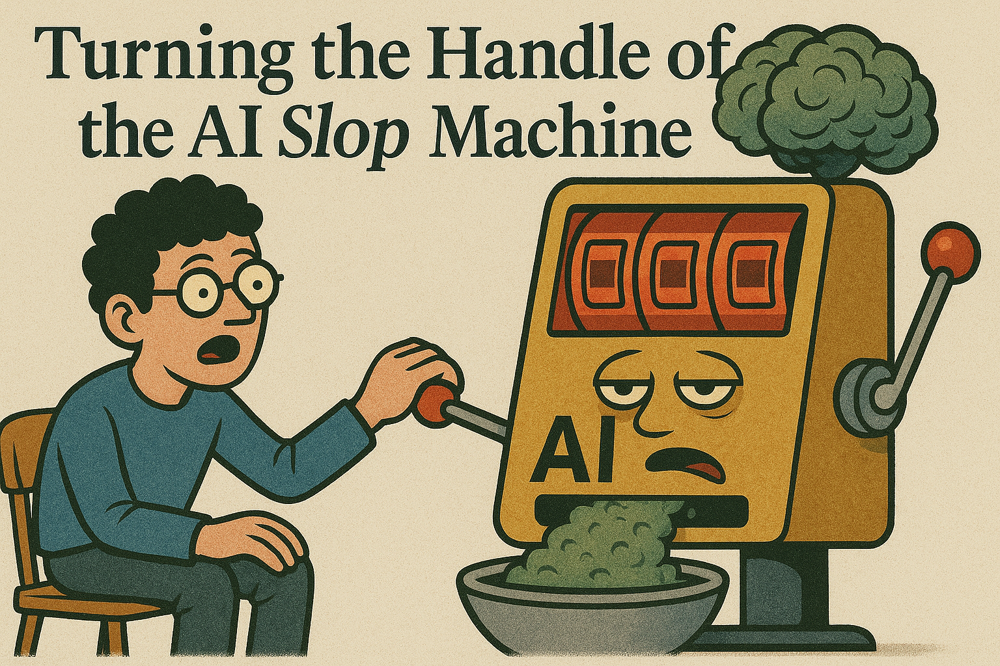

# Turning The Handle of the AI Slop Machine

For some reason, my YouTube feed has become totally and catastrophically polluted with Game of Thrones shorts. Normally in the form of "edits", where everyone's favourite fantasy series is recut over and over with eye-meltingly high saturation and brightness and (slowed and reverbed) sad electronic music. Unfortunately, I also can't stop watching them. 

My favourite creator so far in this micro-genre developed in a lab hijack my brain is [Nihaaledits](https://www.youtube.com/@Nihaaledits/shorts). They work extensively in the Game of Thrones edit niche, producing videos approximately 30 seconds in length with titles like:

1. Birth of Night King ☠️🔥👑 #shorts #houseofthedragon #gameofthrones (https://www.youtube.com/shorts/qitmBINsGGM)
2. Cersei Chooses Violence 🥶🔥The Mountain #shorts #houseofthedragon #gameofthrones (https://www.youtube.com/shorts/zI-bMPkItlw)
3. The Hound Epic Revenge 😡🔥🥶Brother Ray #shorts #houseofthedragon #gameofthrones (https://www.youtube.com/shorts/TYpmbeR1RI4)

The obvious problem this business model is that there are only so many widely loved and incredibly successful TV shows released each year, so you're kind of at the mercy of bigger and slower media houses on creating content. You're also faced with the issue that most TV shows aren't designed to be consumed in hyper-edited 30 second chunks, the source material you're working with is designed with slow or intentional pacing. This might change if studios view edits as a new route towards consumption and engagement with their brands - like how Netflix advises its writers to have their characters [narrate their actions as they are happening](https://www.nplusonemag.com/issue-49/essays/casual-viewing/), as audiences are perceived to increasingly watch television in the background. You can easily imagine tv shows with faster cuts and shorter scenes to better fit in edits (admittedly, this might be hard to square with all the characters self-narrating the whole time). We could even see web-series released in short-form, with stories told through a series of aesthetic and stylised 30-second vignettes. 

As a little Sunday project, I decided to see if I could go one step further, and create something that fits in this mould using AI tools. 

## What I Did

I wanted to ai-ify this as much as possible, so that the end result would be (to borrow a phrase from Succession) "Ikea'd to fuck". Flat-packed content. This means that I wanted AI to write scripts, design each shot, write Veo3 prompts to create the shots, and compose these into coherent short videos. I also wanted a meta-prompt so I could re-create this process. 

I've been feeling some nostalgia for urban fantasy action films, like the Underworld series, so I was interested in applying this approach to a cyberpunk vampire theme. I asked Claude to generate the concept for three episodes of this new series, fit within short video clips that could be composed into YouTube shorts. I'd then take the prompts and put them into Veo3, and once those were complete I edited them together in CapCut following Claude's instructions on shot length and order.

There were a few issues that I had to work out, like Veo3 not handling precise actions of characters correctly (in this case, loading a gun), so I asked Claude to update its prompts to work around these limitations. At the end, I had Claude generate a new prompt that I could use to generate more new episodes and clips, integrating the feedback and challenges that I encountered through using Veo3. 

## What Happened

The end result was a 38 second long YouTube shorts style video (with slowed and reverbed Sleepwalker by Akiaura in the background, of course) which was meant to set the scene for the wider series (named "Neon Blood") that Claude generated. Sadly, it really isn't very good (I am not sure Claude is going to win any best director Oscars any time soon). Give it a [watch here.](https://youtu.be/ECskY1MPsb8)

There are a few things that I would do differently, as well as some technical limitations that I encountered. 
1. I would focus more on instructing Claude to generate clips from a larger story that can fit in 30 seconds, rather than whole stories which are compressed.
2. I think I would lean more into the general style that Edits use, with a focus on cutting things to music more closely (CapCut has some cool features for this). 
3. I originally asked Claude to generate whole stories which could be told through small clips, but I think a better approach would be individual scenes or vignettes of a larger story which would be coherent within a set of small clips, which more closely mirrors the style of the Game of Thrones edits I found anyway. 
4. Actions or intense movement often looked weird when generated by Veo3, and it was hard to get it to generate good quality character, but establishing shots and landscapes looked good for the most part. 

## Conclusions

Overall, I think this process was interesting but fundamentally lacks the creative control that makes good TV good. Precise choreography, selection of props/setting, and carefully designed shot framing are basically all impossible. Admittedly, I don't really know much about each of those individual crafts, but it was still frustrating to me to not be able to actually precisely control the generations. 

Importantly, as someone who doesn't have a background in filmmaking, script writing, or anything related, I defintely didn't feel I could make the most of the tools I had access to. Things might have turned out better if I had more of a sense of what kinds of things should be included, and how to guide Claude and Veo3 in the right direction. 

It also doesn't really feel like something I have much emotional or creative input or stake in - it feels quite far removed from my own creative process or ideas. Maybe that's because I didn't engage with Claude enough to build a world and characters that felt meaningful to me, but in a visual medium there would still be something missing without that finer control, in my view. 

In terms of tech, I found Google's Flow video editor pretty difficult to use, and lacking features. It would have been nice to have something a bit more fully formed, but it does the job for generating clips. 

